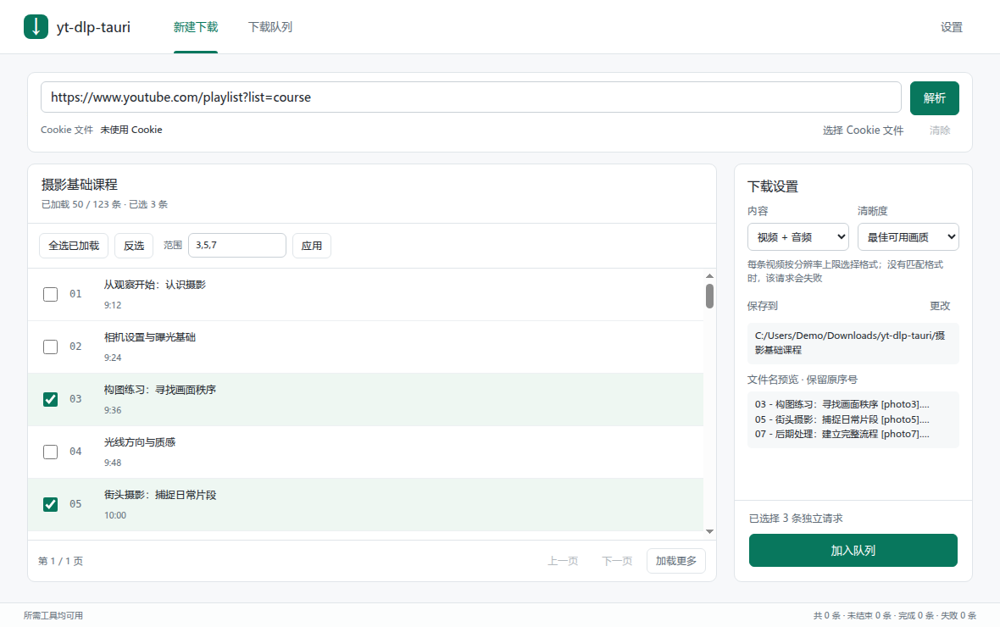
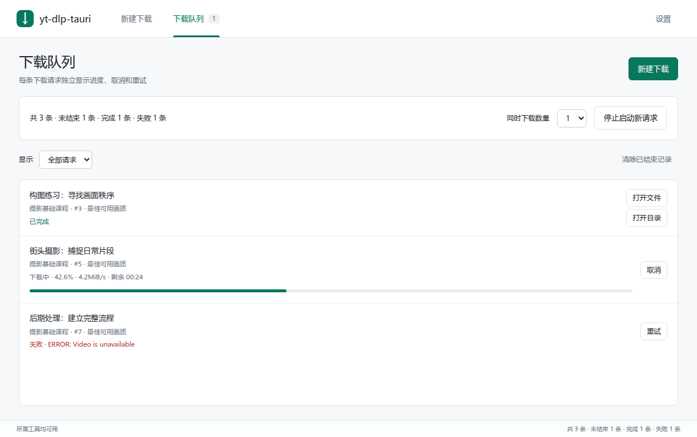

<h1 align="center">yt-dlp-tauri</h1>

<p align="center">
  <strong>一个由 yt-dlp 和 Tauri 2 驱动的轻量 Windows 桌面下载器。</strong>
</p>

<p align="center">
  <a href="./README.md">English</a> ·
  <a href="#快速开始">快速开始</a> ·
  <a href="#配置说明">配置说明</a> ·
  <a href="#验证">验证</a> ·
  <a href="#文档">文档</a>
</p>

<p align="center">
  
  
  
  
  
</p>

<p align="center">
  
</p>

<p align="center">
  
</p>

---

## 项目是什么？

`yt-dlp-tauri` 是一个基于 `yt-dlp` 的小型桌面下载器，用来避免手写命令行参数。粘贴来自 [yt-dlp 支持站点](https://github.com/yt-dlp/yt-dlp/blob/master/supportedsites.md)的视频或播放列表链接，选择内容和清晰度，再按独立请求管理每条下载。

这个项目是 desktop-first 和 local-first 的本地工具。它不是托管下载服务，不提供多用户账号，也不隶属于 `yt-dlp`、FFmpeg、Deno 或 Tauri。

## 功能

- 通过 `yt-dlp` 解析视频信息，并预览标题、封面、时长、来源 URL、描述和清晰度选项。
- 视频解析支持随时取消，超过 120 秒会自动停止。
- 播放列表按每页 50 条加载，支持按原始序号选择、反选及全选已加载条目。
- 每条请求独立显示进度、速度、剩余时间，支持取消、重试与打开输出，同时下载数量可设为 1–3 条。
- 支持视频加音频、仅音频模式；播放列表的清晰度设置按每条视频的分辨率上限执行。
- 启动时显示配置读取错误，修正所报告的问题后可点击“重试启动”。
- 为需要登录态的站点选择 Cookie 文件，支持 Netscape `cookies.txt` 和一行浏览器 Cookie 请求头。
- 支持为媒体解析和下载配置系统／环境代理、直接连接或自定义 HTTP(S)／SOCKS 代理。
- 在 Settings 中安装、更新、重新安装和校验应用管理的完整工具链 revision。
- 可在应用管理工具链与可信本地工具之间切换，本地工具支持从 `PATH` 检测或使用绝对路径选择。
- 从项目托管的不可变 GitHub Release 资产解析 stable 工具链。
- 完整 staging 并校验所有工具后再原子激活，更新失败时保留当前可用 revision。
- 支持中英文界面切换。
- 检查 GitHub Releases 中的应用更新，并可为更新检查和 release 链接启用 `gh-proxy`。
- 写入本地运行日志，方便查看最近的应用事件。

## 技术栈

| 层 | 选择 |
| --- | --- |
| 桌面运行时 | Tauri 2 |
| 后端 | Rust |
| 前端 | Vanilla TypeScript, Vite |
| UI | 固定尺寸的产品型桌面界面 |
| 工具链 | 应用管理或用户选择的 Windows x64 `yt-dlp`、`ffmpeg`、`ffprobe`、`deno` |
| 安装包 | Windows x64 NSIS |

## 快速开始

真实应用构建请在 Windows 上执行。WSL 可以跑很多检查，发布安装包应在 Windows 上构建，或交给 GitHub Actions release workflow。

### 1. 安装系统依赖

- Windows 10/11 x64 + WebView2 Runtime
- Node.js 24+
- Rust stable，安装对应平台 toolchain
- Windows 上需要 PowerShell 5+ 或 PowerShell 7+

### 2. 安装依赖

```powershell
npm ci
```

### 3. 可选：还原开发工具链

```powershell
.\scripts\download-tools.ps1
```

普通使用不需要先执行这个脚本。如果应用检测到工具缺失，打开应用，进入 Settings，点击 `Install tools` 即可。

### 4. 开发运行桌面应用

```powershell
npm run tauri dev
```

### 5. 构建桌面安装包

```powershell
npm run tauri build
```

当前配置的 bundle target 是 `nsis`。构建产物位于：

```text
src-tauri\target\release\bundle\nsis\
```

## 下载流程

1. 在**新建下载**中粘贴链接并解析。链接同时指向视频和列表时，选择**当前视频**或**播放列表或分集**。
2. 播放列表可继续加载更多页，再勾选条目、全选已加载条目，或输入 `3,5-7` 等范围。选择保留原始序号，跳过不可用条目；后续加载的条目不会自动选中。来源未提供的时长、封面等信息显示为未知。
3. 选择内容模式和清晰度，确认保存位置后点击**加入队列**。每条选中视频分别生成一条请求，保留自己的链接、格式和输出位置。
4. 在**下载队列**中单独取消或重试请求。一条失败不会阻塞其他请求。**停止启动新请求**会让正在下载的请求继续运行，等待项在恢复启动后继续调度。

队列及同时下载数量仅保留在本次应用运行中，默认同时下载 1 条，可设为 1–3 条。关闭时如有未结束操作，应用会请求确认；重启后不恢复队列记录。清除已结束记录仅移除队列条目，保留输出文件。

播放列表使用以列表名称命名的子目录，文件名形如 `03 - 标题 [视频ID].mp4`，保留原始序号。文件名中的非法字符会被替换，超长部分会被截断或转换为摘要；扩展名取决于来源和内容模式。目标基本文件名相同的请求串行执行，已有输出不会被覆盖。重试中断的下载时，yt-dlp 可复用其支持续传的未完成文件。

重试保留请求的链接、格式和保存位置，并使用**当前**工具链、Cookie 与代理配置。修改默认目录、Cookie 选择或代理会影响后续新建请求，等待中的请求保留加入队列时的选择。每个运行中的工具使用独立 Cookie 副本，在操作开始时读取所选源文件，且不会修改源文件。存在未结束请求时，应用会禁止安装、替换或切换下载工具。

## 配置说明

| 项 | 用途 |
| --- | --- |
| `toolchain-policy.json` | 经审核的上游来源、版本选择规则、target 和允许访问的 host。 |
| `toolchain-lock.json` | 自动生成的上游身份、不可变归档描述，以及归档和可执行文件 SHA-256。 |
| `src-tauri/tools-manifest.json` | 自动生成的运行时 revision、项目托管归档 URL、target 和可执行文件哈希。 |
| `TOOLCHAIN_CHANGELOG.md` | 独立于应用 release 的工具版本历史。 |
| `src-tauri/tauri.conf.json` | Tauri 应用元信息、固定窗口尺寸、bundle target、图标和资源。 |
| `scripts/download-tools.ps1` | 可选开发脚本，把 pinned `win-x64` 工具链还原到 checkout 中。 |
| Settings: output folder | 用户侧下载目录选择、保存、重置和打开入口。 |
| Settings: network proxy | 保存视频／播放列表解析及下载使用的代理配置。 |
| Settings: GitHub site | 为更新检查和 release 链接选择 `Direct` 或 `gh-proxy`。项目主页始终直连 GitHub。 |
| Settings: tool source | 在经过验证的应用管理 revision 与可信本地可执行文件之间切换。 |

当前发布范围：

- 支持的工具 target：`win-x64`。
- 仓库不提交工具二进制。

## 网络代理

在**设置 → 常规 → 网络代理**中选择模式并点击**保存**：

- **系统／环境代理**（默认）：沿用 yt-dlp 自身的代理检测，包括代理环境变量。检测能力取决于所选 yt-dlp 构建与操作系统，不保证支持 PAC 自动配置。
- **直接连接**：明确让 yt-dlp 的媒体请求绕过代理。
- **自定义代理**：填写完整地址，例如 `http://127.0.0.1:7890` 或 `socks5h://127.0.0.1:1080`。支持 `http`、`https`、`socks4`、`socks4a`、`socks5`、`socks5h`，SOCKS 地址必须包含端口。使用 `socks5h` 可由代理端解析目标域名。HTTPS 代理支持取决于所选 yt-dlp 构建。

保存后对后续视频／播放列表解析、新下载请求和重试生效；已入队及正在运行的请求保留原配置。请求详情显示实际使用的配置，并去掉地址中的凭据。GitHub 更新／Release 路由和 WebView 缩略图请求沿用各自的网络设置。

配置保存在 `%LOCALAPPDATA%\yt-dlp-tauri\state\proxy.json`，重启后继续生效。代理地址可包含 `username:password@host`，凭据以明文保存在本地，并传递给所选 yt-dlp 程序。队列摘要及代理错误中的 URL 会移除地址凭据。无效地址不会覆盖已保存的配置。

## Cookie 文件

Netscape `cookies.txt` 文件保留自身的域名规则。一行 Cookie 请求头需要先粘贴视频 URL，再选择文件；选择结果绑定该 URL 的精确来源（协议、主机名和端口），并在文件名旁显示。切换来源时，需要重新选择适用文件或清除选择。升级前已选择的一行 Cookie 需要重新选择一次，应用不会自动绑定站点。

文件路径和可选来源一起保存在 `%LOCALAPPDATA%\yt-dlp-tauri\state\cookies-file.json`。保存或清除选择前，仍可读取旧版 `cookies-file.txt` 配置。转换后的临时 Cookie 使用精确主机名，并在操作结束后移除。

## 本地工具模式

Settings 可将完整工具链切换为 `应用管理` 或 `本地工具`。本地模式会在当前进程的 `PATH` 中查找 `yt-dlp.exe`、`deno.exe`，并查找同时包含 `ffmpeg.exe` 和 `ffprobe.exe` 的目录。工具不在 `PATH` 中时，可以分别选择 yt-dlp 可执行文件、FFmpeg 目录和 Deno 可执行文件的绝对路径。`使用 PATH` 会清除这些覆盖路径，再次从 `PATH` 解析全部工具。

应用会运行本地工具的版本命令，并执行与受管 revision 相同的确定性媒体兼容性测试。应用不会固定本地文件哈希、安装更新或替换本地程序。本地程序以当前用户权限运行；所选 yt-dlp 会接收视频 URL 和 Cookie 文件，因此应只配置可信的可执行文件。

## 工具链维护

`Toolchain Discovery` workflow 每周解析一次 yt-dlp、Deno、FFmpeg 和 FFprobe，并维护一个经人工审核的 `bot/toolchain-weekly` PR。`Toolchain Freshness` 每天检查已发布的来源 URL，并为失效来源创建独立的紧急 PR。所有变更都需要维护者审核后合并。

工具链变更合并后会先通过原生验证，再发布到独立的 `yt-dlp-tauri-toolchain` 归档仓库。应用跟随 `toolchain-stable` 通道，`TOOLCHAIN_CHANGELOG.md` 独立记录工具 revision，不要求应用同步发版。

可以在本地只查看统一解析结果，不修改文件：

```bash
GITHUB_TOKEN="$(gh auth token)" node scripts/update-toolchain.mjs --dry-run
```

来源和选择规则写在 `toolchain-policy.json`。解析器会一起生成 lock、运行时 manifest 和工具链 changelog。

## 数据、存储和输出

视频默认下载到：

```text
%USERPROFILE%\Downloads\yt-dlp-tauri\
```

应用状态和日志位于：

```text
%LOCALAPPDATA%\yt-dlp-tauri\state\
%LOCALAPPDATA%\yt-dlp-tauri\logs\app.log
```

工具来源和可选绝对路径配置位于：

```text
%LOCALAPPDATA%\yt-dlp-tauri\state\toolchain-source.txt
%LOCALAPPDATA%\yt-dlp-tauri\state\local-toolchain.json
```

安装后的应用会把工具链 revision 写入：

```text
%LOCALAPPDATA%\yt-dlp-tauri\Tools\win-x64\active.json
%LOCALAPPDATA%\yt-dlp-tauri\Tools\win-x64\revisions\<revision>\
```

首次成功激活 revision 前，应用仍可读取 v0.1.11 的平铺工具目录。

开发 checkout 工具可以位于：

```text
src-tauri\Tools\win-x64\yt-dlp\yt-dlp.exe
src-tauri\Tools\win-x64\ffmpeg\bin\ffmpeg.exe
src-tauri\Tools\win-x64\ffmpeg\bin\ffprobe.exe
src-tauri\Tools\win-x64\deno\deno.exe
```

## 验证

前端测试：

```powershell
npm test
```

前端构建：

```powershell
npm run build
```

Rust 后端测试：

```powershell
cargo test --manifest-path .\src-tauri\Cargo.toml --lib
```

Rust 后端检查：

```powershell
cargo check --manifest-path .\src-tauri\Cargo.toml
```

完整 Tauri 构建：

```powershell
npm run tauri build
```

## 文档

- [变更日志](./CHANGELOG.md)
- [贡献说明](./CONTRIBUTING.md)
- [安全策略](./SECURITY.md)
- [第三方声明](./THIRD-PARTY-NOTICES.md)
- [工具链策略](./toolchain-policy.json)
- [工具链变更记录](./TOOLCHAIN_CHANGELOG.md)
- [工具 manifest](./src-tauri/tools-manifest.json)

## 星标历史

<a href="https://star-history.dera.page/#Chlience/yt-dlp-tauri&type=date&legend=top-left">
 <picture>
   <source media="(prefers-color-scheme: dark)" srcset="https://star-history.dera.page/svg?repos=Chlience/yt-dlp-tauri&type=date&theme=dark&legend=top-left" />
   <source media="(prefers-color-scheme: light)" srcset="https://star-history.dera.page/svg?repos=Chlience/yt-dlp-tauri&type=date&legend=top-left" />
   
 </picture>
</a>

## 发布前检查

发布 release 前：

1. 运行上面的验证命令。
2. 对准确的 release commit 以 preflight 模式运行 `Release` workflow，并验证干净安装产物。
3. 推送版本 tag，例如 `v0.1.12`。
4. 等待 `Release` workflow 把 Windows x64 NSIS 安装包和 `tools-manifest.json` 上传到 draft GitHub Release。
5. 确认 `src-tauri/tools-manifest.json` 使用固定 release URL，不使用 `latest`。
6. 确认生成目录和还原出来的工具没有被 staged。
7. 随 release 保留 GPL 许可证和第三方声明。

## 法律说明

本项目使用 GPL-3.0 许可证。应用会下载并使用第三方命令行工具，这些工具有各自的许可证和再分发义务。详见 [THIRD-PARTY-NOTICES.md](./THIRD-PARTY-NOTICES.md)。

本项目不隶属于 `yt-dlp`、FFmpeg、Deno 或 Tauri。
